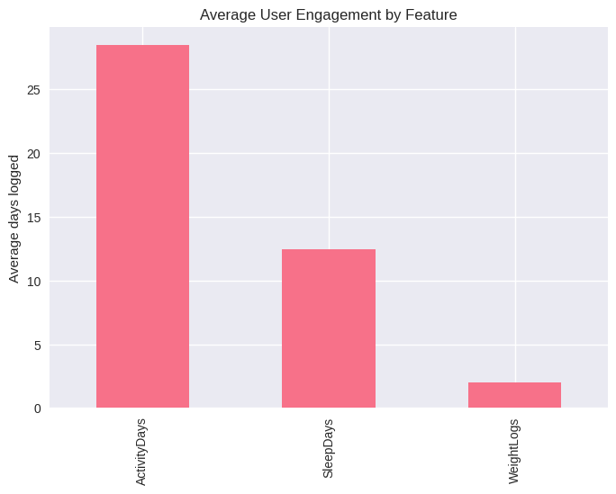

# analysis on fitbit data from `https://www.kaggle.com/datasets/arashnic/fitbit/data`

## The Problem

Business Task: Identify usage trends in fitness tracker features (activity, sleep, weight) and determine how these insights can inform Bellabeat’s marketing strategy.

Stakeholders: Bellabeat marketing analytics team, Urška Sršen, Sando Mur, executive team.

## Preparation

Data Source: Public Fitbit Fitness Tracker dataset from Kaggle (CC0 Public Domain).

Organization: Multiple CSV files in wide format, containing daily activity, sleep, and weight logs.

Limitations: Small sample (30 users), self-reported or device-recorded data with potential bias.

Data Integrity: Verified file completeness, consistent column structures.

### Dataset

much of data was already part of activity tracking and much was short timeframes,
so, Three key datasets were analyzed:

- **Activity Tracking** (steps, calories, distance)
- **Sleep Tracking** (total minutes asleep, time in bed)
- **Weight Tracking** (weight, BMI, fat %)

## Process

Tools: Python (pandas, matplotlib, seaborn) for cleaning and analysis.
Cleaning:

- already mostly no missing in chosen data, dropped one column(fat) that was
- make the entries unique

## Analyze

### User Coverage

| Feature          | Users with Data | Median Days Logged | Average Days Logged |
|------------------|-----------------|--------------------|---------------------|
| Activity         | 33              | 31                 | 28.5                |
| Sleep            | 24              | 5                  | 12.4                |
| Weight           | 8               | 0                  | 2.0                 |

**Key observation**: All users log activity, fewer log sleep, very few log weight.

---

### Usage by Engagement Tier

| Tier         | Most Used Features               |
|--------------|----------------------------------|
| Power Users  | Activity, Sleep, some Weight     |
| Engaged Users| Activity + Sleep                 |
| Casual Users | Activity only                    |

---

---

## Share

### Visualization

**Feature Usage Distribution**

**Engagement Tier Composition**

**Tier vs enagement in different features**

---

### Reasoning (Hypotheses)

**Activity tracking**  

- Immediate, visible results (step counter)  
- Low friction: automatically logged  

**Sleep tracking**  

- Moderate adoption; may require intentional effort  
- Possible barriers: device compatibility, setup friction  

**Weight tracking**  

- Very low adoption; changes occur slowly, reducing short-term feedback  
- Often requires manual input  

## Action

_This analysis suggests that improving core activity features and lowering friction for sleep tracking could yield higher engagement, while weight tracking is unlikely to become a primary feature without strategic changes._

### Recommendations

- Focus Bellabeat marketing on activity tracking as the gateway feature.

- Promote sleep tracking as an added benefit for engaged users.

- Position weight tracking as a tool for advanced/power users.
